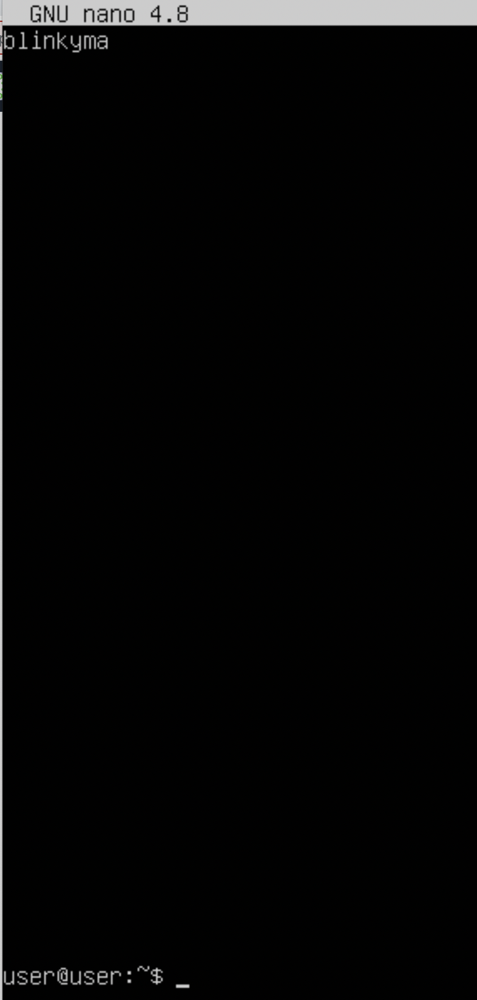
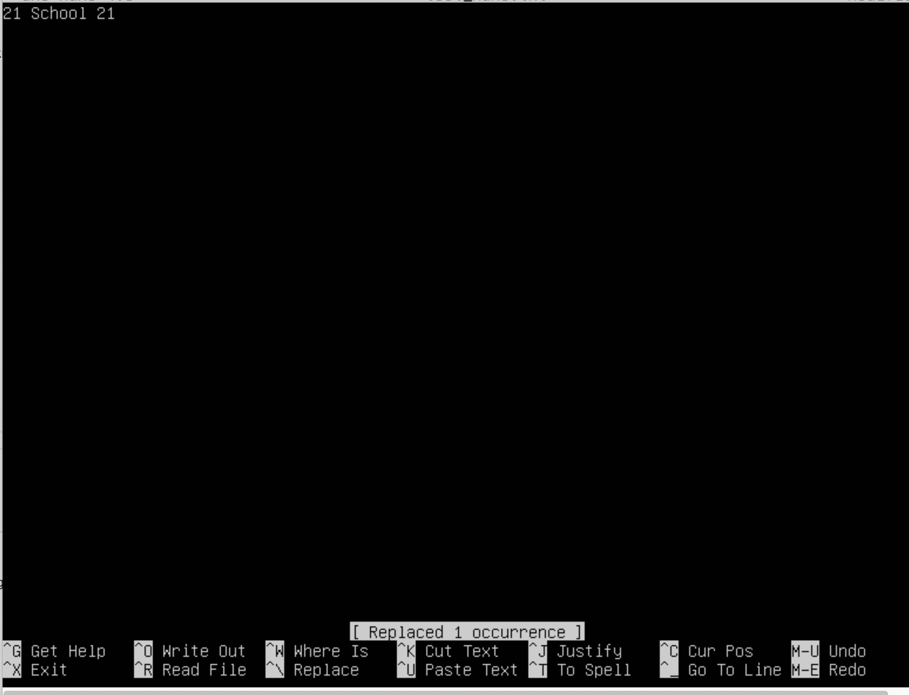

## 1. Установка ОС
Проверка версии

/etc/os-release

/etc/issue

## 2. Создание пользователя
Создание пользователя

Вывод списка пользователей

## 3. Настройка сети ОС
- Задание названия машины и проверка

Задание названия машины вида user-1
- Установка временной зоны и проверка

Установка временной зоны
- Вывод названия сетевых интерфейсов 

**lo это имя виртуального интерфейса loopback, который является средством межпроцессного обмена информацией для локальных процессов.**

Вывод названия сетевых интерфейсов

- Получение ip адреса устройства от DHCP сервера
  
**Протокол DHCP (Dynamic Host Configuration Protocol — протокол динамической настройки узла)**

Получение ip адреса устройства от DHCP сервера

- Изменение сетевых настроек

Сетевые настройки

- Применение конфигурации сети - sudo netplan try

-  Проверка сетевых настроек
  
Проверка сетевых настроек

- Пинг до Яндекса
    

## 4.Обновление ОС
https://losst.ru/ustanovka-obnovlenij-ubuntu

- Обновление информации о пакетах, находящихся в репозиториях  sudo apt-get update

- Обновление через терминал с помощью команды sudo apt-get dist-upgrade

** upgrade - устанавливает самые новые версии всех пакетов доступные в репозиториях
** dist-upgrade делает то же самое, что upgrade плюс выполняет "умное" разрешения конфликтов версий пакетов. При конфликтах пакетов Ubuntu попытается обновить наиболее важные пакеты за счет менее важных, поэтому команда dist-upgrade может установить дополнительные пакеты или удалить один из конфликтующих пакетов

## 5. Использование команды sudo
- Как разрешить пользователю user3, созданному в Part 2, выполнять команду sudo:
  1. добавить пользователя в группу sudo: usermod -aG sudo user3

  2. проверка
 

- Поменять hostname ОС от имени пользователя user3 (используя sudo)

- Cкрин с изменённым hostname

** Команда sudo обеспечивает привилегии обычному пользователию для реализации прав администратора, которые всегда доступны только пользователю типа root user

## 6. Установка и настройка службы времени
Настроить службу автоматической синхронизации времени.

-Проверка работы службы синхронизации - служба timesyncd

Здесь же отображается часовой пояс

-Вывод команды timedatectl show содержит NTPSynchronized=yes: 

Скрины с корректным временем и выводом команды

## 7. Работа в текстовых редакторах
Проверили наличие редакторов: vim, nano

Установили редактор mcedit

- Работа в vim

Создание и сохранение файла

Выход с сохранением. esc - войти в режим командной строки

- Создание документа в nano 

Выход с сохранением shift+ctrl+x, нажать yes

- Создание документа в mcedit

Вызов mcedit, выход с сохранением и присвоением имени - клавиши esc (командный режим), 2

**Открыть файлы для редактирования, выйти без сохранения изменений
- В редакторе vim

Открытие файла команда vim test_vim.txt

Выход без сохранения :q!
- В редакторе nano

  Открыть: nano test_nano.txt

  Редактировать: ctrl+R (replace)

  Выйти без сохранения: ctrl+shift+X

  

- В редакторе mcedit

Открыть: mcedit test_mcedit.txt

Нажать esc 4: внести то что заменяем, и на что заменяем

Выход без сохранения

** Отредактировать файл, использовать функции поиска по содержимому файла (слово) и замены слова на любое другое

- В вим в режиме команд нажадать / Enter, набрать искомое слово
- 

- Замена командой :s/blinkyma/school21/
- 

- В nano выбрать функцию Replace
  

  

- В mcedit выбрать функцию для замены, нажав клавишу 4 в режиме команд (esc)
- 

## Part 8. Установка и базовая настройка сервиса SSHD.
### 1. Установить службу SSHd.
*SH* или *Secure Shell* - это протокол безопасного доступа из одного компьютера к другому по сети. 

SSH (Secure Shell) — сетевой протокол прикладного уровня, который позволяет управлять операционной системой и выполнять функцию туннелирования TCP-соединения. Работа SSH построена на взаимодействии 2-х компонентов: SSH-сервера и SSH-клиента.

У протокола __SSH__ очень много возможностей. Вы можете создавать защищенные соединения между компьютерами, 
открывать командную строку на удаленном компьютере, запускать графические программы, передавать файлы и 
организовывать частные сети.

Для установки необходимо выполнить команду __`sudo apt install openssh-server`__.

Команды:
sudo su - переключиться root-пользователя
-Перенастроить службу SSHd на порт 2022:
sudo vim /etc/ssh/sshd_config - редактирование конфигурации
- установка SSHd на порт 2022
- sudo apt update - обновление репозитория
- sudo apt-get install ssh - установление ssh с помощью команды
- sudo apt install openssh-server - установите openssh
- проверка установки OpenSSH
- 
-  Настройка OpenSSH 
sudo vim /etc/ssh/sshd_config
- Замена порта на 2022
- 
- Перезагрузка демона ssh: systemctl restart sshd
  
  Для применения ssh потребовалось изменить настройки сети, был добавлен еще один сетевой интерфейс.
  
- Используя команду ps, показать наличие процесса sshd -  ps waux | grep ssh
- 

- Вывод команды netstat -tan, установка команды netstat
  t - вывод соединений по протоколу TCP.
  a - all. Отображение всех подключений и ожидающих портов.
  n - numeric. Отображение адресов и номеров портов в числовом формате.
- 
- Proto - The protocol of the connection: TCP, UDP, or raw.
- Recv-Q - Применительно к TCP-соединению в этом столбце отображается количество байтов, полученных локальным сетевым интерфейсом, но не прочитанных подключенным процессом.
- Send-Q - Применительно к TCP-соединению в этом столбце отображается количество байтов, отправленных на другую сторону соединения, но не подтвержденных удаленным хостом.
- Local Address - Локальный адрес и порт для подключения. По умолчанию это будет отображать имя хоста для адреса, если оно может быть разрешено. Имя службы для порта (например, SSH для порта 22) также будет отображаться по умолчанию.
- Foreign Address - Адрес и номер порта для подключенного хоста. Имя хоста и имя службы будут отображаться по умолчанию, аналогично поведению для столбца «Локальный адрес».
- State - Состояние соединения. Поскольку необработанные и UDP-соединения, как правило, не содержат информации о состоянии, этот столбец обычно будет пустым для этих типов соединений. Для TCP-соединений столбец State будет иметь значение, соответствующее одному из состояний, заданных TCP: SYN_RECV, SYN_SENT, ESTABLISHED и т. д. По умолчанию соединения в состоянии LISTEN не будут отображаться.

 Значение 0.0.0.0 - IP-адрес 0.0.0.0 может использоваться на серверах для обозначения того, что служба может связываться со всеми сетевыми интерфейсами. Он дает команду серверу «прослушивать» и принимать соединения с любого IP-адреса.

Примечание: Подключиться к удаленному терминалу по ssh

 Part 9. Установка и использование утилит top, htop
Утилиты были предустановлены. Запускаем top

1 - uptime 
2 - количество авторизованных пользователей
3 - общую загрузку системы
4 - общее количество процессов
5 - загрузку cpu
6 - загрузку памяти
7 - pid процесса занимающего больше всего памяти
8 - pid процесса, занимающего больше всего процессорного времени 

#### В отчёт вставить скрин с выводом команды htop:

- отсортированному по PID, PERCENT_CPU, PERCENT_MEM, TIME
  
   
  Process ID

   
  Процент загрузки процессора PERCENT_CPU

   
  Процент загрузки памяти

   
  TIME

- отфильтрованному для процесса sshd
 

- с процессом syslog, найденным, используя поиск
 

- с добавленным выводом hostname, clock и uptime (через setup)

## Part.10 Использование утилиты fdisk

Команда sudo fdisk -l

Название жесткого диска - /dev/sda
Размер - 10 ГиБ
Количество секторов - 20971520
Размер swap - swap нет (т.к. не был создан при разметке диска)

## Part.11 Использование утилиты df 

df позволяет получить информацию о дисковом пространстве

В отчёте написать для корневого раздела (/):

размер раздела - 9336140 Кб
размер занятого пространства - 4600552 Кб
размер свободного пространства - 4241612 Кб
процент использования - 53%

Определить и написать в отчёт единицу измерения в выводе. Используется блок размером 1 Кб.

Запустить команду df -Th.

В отчёте написать для корневого раздела (/):

- размер раздела 9 Гб
- размер занятого пространства 4,4 Гб
- размер свободного пространства 4,1 Гб
- процент использования 53%

Определить и написать в отчёт тип файловой системы (-T) для раздела. ext4

## Part12. Использование утилиты du - disk usage
- df - не единственный способ поучить информацию о дисковом пространстве. 
Запустить команду du.
Вывести размер папок 
/home, 

Общий размер папок 152К

Общий размер папок 96177 байт

/var,

Общий размер папок 854Мб

Общий размер папок 886016761 байт

/var/log 

Общий размер папок 124Мб

Общий размер папок  130149494 байт

(в байтах, в человекочитаемом -h виде)

Вывести размер всего содержимого в /var/log (не общее, а каждого вложенного элемента, используя *)

В отчёт вставить скрины с выводом всех использованных команд.

## Part 13. Установка и использование утилиты ncdu

Поэтому сейчас мы рассмотрим улучшенную версию du.
== Задание ==

Установить утилиту ncdu.

Вывести размер папок /home, /var, /var/log.

Размер 132 КиБайт для user
Размер 16 КиБайт для user10

Размер общий примерно 854 Мб

Размер общий 123,9 Мб

Размеры должны примерно совпадать с полученными в Part 12.

В отчёт вставить скрины с выводом использованных команд.

## Part 14. Работа с системными журналами
- Системному администратору иногда приходится просматривать события, происходившие в системе в недавнем прошлом. Для этого в Linux есть системные журналы.
== Задание ==

Открыть для просмотра:

1. /var/log/dmesg
Для вывода сообщений от ядра, пока сервис Syslog не запущен

2. /var/log/syslog    системный журнал

3. /var/log/auth.log

Написать в отчёте время последней успешной авторизации - 00:45:58
имя пользователя - user
метод входа в систему - ssh.
Перезапустить службу SSHd. *sudo service sshd restart*

Вставить в отчёт скрин с сообщением о рестарте службы (искать в логах).

Part 15. Использование планировщика заданий CRON

Сейчас я покажу программу, которая, помимо прочего, заметно упрощает периодический вызов других программ.
== Задание ==

Используя планировщик заданий, запустите команду uptime через каждые 2 минуты.

Найти в системных журналах строчки (минимум две в заданном временном диапазоне) о выполнении.

Вывести на экран список текущих заданий для CRON.

Вставить в отчёт скрины со строчками о выполнении и списком текущих задач.

Удалите все задания из планировщика заданий.

Удалила команду: crontab -e (удалить команду d$)
crontab -l (список текущих заданий для cron)

В отчёт вставьте скрин со списком текущих заданий для CRON.

